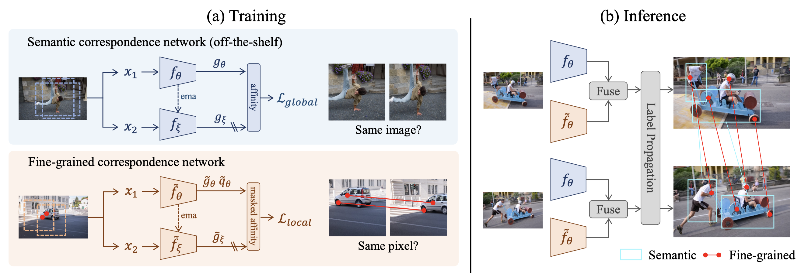

# Semantic-Aware Fine-Grained Correspondence

This repository is the official PyTorch implementation for SFC introduced in the paper:

Semantic-Aware Fine-Grained Correspondence. ECCV 2022 (**Oral**)
<br>
Yingdong Hu, Renhao Wang, Kaifeng Zhang, and Yang Gao
<br>

<div align="center">

</div>


## Installation

### Dependency Setup
* Python 3.8
* PyTorch 1.8.0
* Other dependencies

Create an new conda environment.
```
conda create -n sfc python=3.8 -y
conda activate sfc
```
Install [PyTorch](https://pytorch.org/)==1.8.0, [torchvision](https://pytorch.org/vision/stable/index.html)==0.9.0 following official instructions. For example:
```
conda install pytorch==1.8.0 torchvision==0.9.0 cudatoolkit=11.1 -c pytorch -c conda-forge
```
Clone this repo and install required packages:
```
git clone https://github.com/Alxead/SFC.git
pip install opencv-python matplotlib scikit-image imageio pandas tqdm wandb
```

### Dataset Preparation 
We use [YouTube-VOS](https://competitions.codalab.org/competitions/19544#participate-get-data) to pre-train fine-grained correspondence network.

Download raw image frames (`train_all_frames.zip`). Move `ytvos.csv` from `code/data/` to the directory of YouTube-VOS dataset.

The overall file structure should look like:
```
youtube-vos
├── train_all_frames
│   └── JPEGImages
└── ytvos.csv
```


## Pre-training Fine-grained Correspondence Network
To pre-train with a single 24GB NVIDIA 3090 GPU, run:
```
python train.py \
--data-path /path/to/youtube-vos \
--output-dir ../checkpoints \
--enable-wandb True
``` 
Training time is about 25 hours.

### Pre-trained Model
Our fine-grained correspondence network and other baseline models can be downloaded as following:

| Pre-training Method | Architecture |Link | 
| :---: | :---: | :---: |
| Fine-grained Correspondence | ResNet-18 |  [download](https://github.com/Alxead/SFC/releases/download/v0.1/pretrained_fc.pth)   |
| [CRW](https://arxiv.org/abs/2006.14613) | ResNet-18 |[download](https://github.com/ajabri/videowalk/raw/master/pretrained.pth)    |
| [MoCo-V1](https://arxiv.org/abs/1911.05722)| ResNet-50 |[download](https://dl.fbaipublicfiles.com/moco/moco_checkpoints/moco_v1_200ep/moco_v1_200ep_pretrain.pth.tar)|
| [SimSiam](https://arxiv.org/abs/2011.10566) | ResNet-50 |[download](https://dl.fbaipublicfiles.com/simsiam/models/100ep-256bs/pretrain/checkpoint_0099.pth.tar)|
| [VFS](https://arxiv.org/abs/2103.17263) | ResNet-50 | [download](https://github.com/xvjiarui/VFS/releases/download/v0.1-rc1/r50_nc_sgd_cos_100e_r5_1xNx2_k400-d7ce3ad0.pth)    |
| [PixPro](https://arxiv.org/abs/2011.10043) | ResNet-50 |[download](https://drive.google.com/file/d/1Ox2RoFbTrrllbwvITdZvwkNnKUQSUPmV/view?usp=sharing)|
| ImageNet classification | ResNet-50 | torchvision |

After downloading a pre-trained model, place it  under `SFC/checkpoints/` folder. Please don't modify the file names of these checkpoints.

## Evaluation: Label Propagation

<p float="left">


</p>

The label propagation algorithm is based on the implementation of [Contrastive Random Walk (CRW)](https://github.com/ajabri/videowalk). The output of `test_vos.py` (predicted label maps) must be post-pocessed for evaluation.

### DAVIS
To evaluate a model on the DAVIS task, clone [davis2017-evaluation](https://github.com/davisvideochallenge/davis2017-evaluation) repository.
```
git clone https://github.com/davisvideochallenge/davis2017-evaluation $HOME/davis2017-evaluation
```
Download [DAVIS2017](https://davischallenge.org/davis2017/code.html) dataset from the official website. Modify the paths provided in `code/eval/davis_vallist.txt`.

### Inference and Evaluation
To evaluate SFC (after downloading pre-trained model and place it under `SFC/checkpoints`), run:

**Step 1: Video object segmentation**
```
python test_vos.py --filelist ./eval/davis_vallist.txt \
--fc-model fine-grained --semantic-model mocov1 \
--topk 15 --videoLen 20 --radius 15 --temperature 0.1  --cropSize -1 --lambd 1.75 \
--save-path /save/path
```

**Step 2: Post-process**
```
python eval/convert_davis.py --in_folder /save/path/ --out_folder /converted/path --dataset /path/to/davis/
```

**Step 3: Compute metrics**
```
python $HOME/davis2017-evaluation/evaluation_method.py \
--task semi-supervised --set val \
--davis_path /path/to/davis/ --results_path /converted/path 
```

This should give:
```
 J&F-Mean   J-Mean  J-Recall  J-Decay   F-Mean  F-Recall  F-Decay
 0.713385 0.684833  0.812559 0.171174 0.741938  0.851699 0.234408
```
The reproduced performance in this repo is slightly higher than reported in the paper.


---
Here you'll find the command-lines to evaluate some baseline models.

<details>
<summary>
Fine-grained Correspondence Network (FC)
</summary>

For step 1, run:
```
python test_vos.py --filelist ./eval/davis_vallist.txt \
--fc-model fine-grained \
--topk 10 --videoLen 20 --radius 12 --temperature 0.05 --cropSize -1 \
--save-path /save/path
```

Run step 2 and step 3, this should give:
```
 J&F-Mean   J-Mean  J-Recall  J-Decay   F-Mean  F-Recall  F-Decay
 0.679752 0.650268  0.767701 0.204185 0.709237  0.825303 0.267199
```
</details>

<details>
<summary>
Contrastive Random Walk (CRW)
</summary>

For step 1, run:
```
python test_vos.py --filelist ./eval/davis_vallist.txt \
--fc-model crw \
--topk 10 --videoLen 20 --radius 12 --temperature 0.05 --cropSize -1 \
--save-path /save/path
```

Run step 2 and step 3, this should give:
```
 J&F-Mean   J-Mean  J-Recall  J-Decay   F-Mean  F-Recall  F-Decay
 0.677813 0.648103  0.759397 0.199973 0.707523  0.834314  0.24343
```
</details>

<details>
<summary>
ImageNet Classification
</summary>

For step 1, run:
```
python test_vos.py --filelist ./eval/davis_vallist.txt \
--semantic-model imagenet50 \
--topk 10 --videoLen 20 --radius 12 --temperature 0.05 --cropSize -1 \
--save-path /save/path
```

Run step 2 and step 3, this should give:
```
* Acc@1 83.372 Acc@5 96.482 loss 0.685
```
</details>

<details>
<summary>
MoCo-V1
</summary>

For step 1, run:
```
python test_vos.py --filelist ./eval/davis_vallist.txt \
--semantic-model mocov1 \
--topk 10 --videoLen 20 --radius 12 --temperature 0.05 --cropSize -1 \
--save-path /save/path
```

Run step 2 and step 3, this should give:
```
* Acc@1 83.372 Acc@5 96.482 loss 0.685
```
</details>

<details>
<summary>
SimSiam
</summary>

For step 1, run:
```
python test_vos.py --filelist ./eval/davis_vallist.txt \
--semantic-model simsiam \
--topk 10 --videoLen 20 --radius 12 --temperature 0.05 --cropSize -1 \
--save-path /save/path
```

Run step 2 and step 3, this should give:
```
* Acc@1 83.372 Acc@5 96.482 loss 0.685
```
</details>

<details>
<summary>
VFS
</summary>

For step 1, run:
```
python test_vos.py --filelist ./eval/davis_vallist.txt \
--semantic-model vfs \
--topk 10 --videoLen 20 --radius 12 --temperature 0.05 --cropSize -1 \
--save-path /save/path
```

Run step 2 and step 3, this should give:
```
* Acc@1 83.372 Acc@5 96.482 loss 0.685
```
</details>


<details>
<summary>
PixPro
</summary>

For step 1, run:
```
python test_vos.py --filelist ./eval/davis_vallist.txt \
--semantic-model pixpro \
--topk 10 --videoLen 20 --radius 12 --temperature 0.05 --cropSize -1 \
--save-path /save/path
```

Run step 2 and step 3, this should give:
```
* Acc@1 83.372 Acc@5 96.482 loss 0.685
```
</details>


## Acknowledgement
We have modified and integrated the code from [CRW](https://github.com/ajabri/videowalk) and [PixPro](https://github.com/zdaxie/PixPro) into this project.


## Citation

If you find this repository useful, please consider giving a star :star: and citation:
```latex

```
